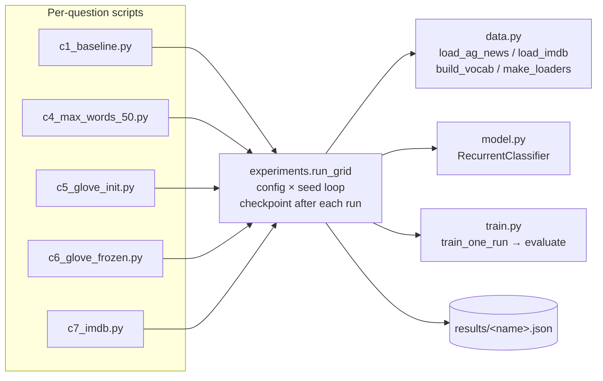

# NLP NCSR — Assignment 2 (RNNs & Word Embeddings)

[](https://colab.research.google.com/github/Fgram-devAI/nlp-ncsr-task2/blob/main/notebooks/part_c_rnn_colab.ipynb)

Implementation of Assignment 2 for the NCSR "Επεξεργασία Φυσικής Γλώσσας" (NLP) course.

The assignment has three parts:

| Part | Topic                                       | Status      |
|------|---------------------------------------------|-------------|
| A    | Word embeddings (word2vec / GloVe)          | done        |
| B    | Traditional text classification (NB / SVM)  | done        |
| C    | Text classification with RNNs / LSTMs       | done        |

📄 **Final report:** [NLP_Assignment2_Grammatikopoulos.pdf](NLP_Assignment2_Grammatikopoulos.pdf) — single-document deliverable with answers, tables and commentary for all three parts.

## Setup

```bash
# 1. Create the conda env (Python 3.11)
conda create -n nlp-ncsr-task2 python=3.11 -y
conda activate nlp-ncsr-task2

# 2. Install Python dependencies
pip install -r requirements.txt
```

The first run that loads the pre-trained word embeddings will download
~2 GB to `~/gensim-data/` (cached for subsequent runs):

- `word2vec-google-news-300` — 1.66 GB
- `glove-wiki-gigaword-300`  — 376 MB

## Project structure

```
nlp-ncsr-task2/
├── README.md
├── requirements.txt
├── .gitignore
├── NLP_Assignment2_Grammatikopoulos.pdf        # final report (LaTeX-built)
├── notebooks/                                  # one notebook per part
│   ├── part_a_embeddings.ipynb                 # Part A — word2vec / GloVe exploration
│   ├── part_b_traditional.ipynb                # Part B — NB / SVM on AG News
│   ├── part_c_rnn.ipynb                        # Part C — local viewer; loads JSONs
│   └── part_c_rnn_colab.ipynb                  # Part C — re-runs on Colab CUDA T4
├── part_a_embeddings/                          # Part A scripts
│   ├── embeddings_utils.py
│   ├── a1_given_words.py … a6_tsne_glove.py
│   └── figures/tsne_glove_a6.png
├── part_b_traditional_txt_classification/      # Part B scripts
│   ├── data_utils.py                           # AG News loader (kagglehub)
│   ├── b1_train_models.py                      # train + report 4 models
│   └── b2_error_analysis.py                    # docs all 4 models miss
└── part_c_rnn_classification/                  # Part C scripts (RNN/LSTM)
    ├── data.py                                 # tokenizer, vocab, AG News + IMDB loaders
    ├── model.py                                # RecurrentClassifier (covers all 6 variants)
    ├── train.py                                # train_one_run + evaluate
    ├── experiments.py                          # run_grid driver + checkpointing
    ├── c1_baseline.py … c7_imdb.py             # one driver script per question
    ├── results/*.json                          # per-experiment metrics + predictions
    └── figures/                                # t-SNE plots
```

### Part C — module map



`c2_cpu_vs_gpu.py` and `c3_tsne_learned.py` are stand-alone (they don't go through the grid driver).

## Running Part A

Each exercise is a standalone script. Run from inside `part_a_embeddings/`:

```bash
cd part_a_embeddings
python a1_given_words.py
python a2_own_words.py
python a3_student.py
python a4_given_analogies.py
python a5_own_analogies.py
python a6_tsne_glove.py     # also opens a matplotlib window
```

Or run everything in one place via the notebook:

```bash
jupyter lab notebooks/part_a_embeddings.ipynb
```

## Running Part B

The dataset auto-downloads via `kagglehub` on first run (requires Kaggle
credentials in `~/.kaggle/kaggle.json`). Cached under `~/.cache/kagglehub/`.

```bash
cd part_b_traditional_txt_classification
python b1_train_models.py        # accuracy / dim / time table for all 4 models
python b2_error_analysis.py      # docs misclassified by all 4
```

Or in one place:

```bash
jupyter lab notebooks/part_b_traditional.ipynb
```

## Running Part C

Reuses the same Kaggle credentials. C.5 / C.6 also pull
`glove-wiki-gigaword-100` (~128 MB) via gensim on first call.

Each script saves a JSON to `part_c_rnn_classification/results/` and is
**resumable** — interrupted runs pick up from the last completed
(model × seed). Run from the project root:

```bash
python -m part_c_rnn_classification.c1_baseline       # 6 models × 3 seeds, MAX_WORDS=25
python -m part_c_rnn_classification.c2_cpu_vs_gpu     # 1RNN + 1LSTM, CPU vs MPS/CUDA
python -m part_c_rnn_classification.c3_tsne_learned   # t-SNE of 1RNN-learned embeddings
python -m part_c_rnn_classification.c4_max_words_50   # repeat C.1 with MAX_WORDS=50
python -m part_c_rnn_classification.c5_glove_init     # repeat C.1 with GloVe init (trainable)
python -m part_c_rnn_classification.c6_glove_frozen   # repeat C.5 with frozen embeddings
python -m part_c_rnn_classification.c7_imdb           # repeat C.1 on IMDB (80/20 split)
```

Two notebooks ship for Part C:

- [`notebooks/part_c_rnn.ipynb`](notebooks/part_c_rnn.ipynb) — local viewer; **does not retrain**, only loads the saved JSONs and renders tables / figures. Open with `jupyter lab notebooks/part_c_rnn.ipynb`.
- [`notebooks/part_c_rnn_colab.ipynb`](notebooks/part_c_rnn_colab.ipynb) — **re-runs** the full grid on a Colab CUDA T4 (no Kaggle account needed — uses HuggingFace `datasets` for AG News + IMDB). One-click open: [](https://colab.research.google.com/github/Fgram-devAI/nlp-ncsr-task2/blob/main/notebooks/part_c_rnn_colab.ipynb)

## Part C — Results summary

All experiments use `epochs=15`, `batch_size=1024`, `embedding_dim=100`,
`hidden_dim=64`, `lr=1e-3`, `min_freq=10`, **3 seeds**. Numbers below are the
mean over the 3 seeds.

### Test-set accuracy (mean ± std)

Experiments C.1, C.4, C.5, C.6 are on **AG News**; C.7 is on **IMDB** (different task).

| Model     | C.1 (MW=25)         | C.4 (MW=50)         | C.5 (GloVe trainable) | C.6 (GloVe frozen)    | C.7 (IMDB MW=25)    |
|-----------|---------------------|---------------------|-----------------------|-----------------------|---------------------|
| 1RNN      | 0.8841 ± 0.0030     | 0.8717 ± 0.0113     | 0.8977 ± 0.0027       | 0.8833 ± 0.0022       | **0.7162 ± 0.0032** |
| 1Bi-RNN   | **0.8862 ± 0.0057** | 0.8968 ± 0.0030     | 0.8954 ± 0.0035       | 0.8867 ± 0.0010       | 0.7017 ± 0.0006     |
| 2Bi-RNN   | 0.8828 ± 0.0017     | 0.8963 ± 0.0028     | 0.8954 ± 0.0016       | 0.8893 ± 0.0029       | 0.7016 ± 0.0017     |
| 1LSTM     | 0.8840 ± 0.0010     | 0.8998 ± 0.0037     | 0.8991 ± 0.0017       | 0.9030 ± 0.0036       | 0.7147 ± 0.0063     |
| 1Bi-LSTM  | 0.8798 ± 0.0014     | 0.9011 ± 0.0014     | **0.9016 ± 0.0030**   | 0.9075 ± 0.0022       | 0.7099 ± 0.0064     |
| 2Bi-LSTM  | 0.8846 ± 0.0023     | **0.9016 ± 0.0044** | 0.9005 ± 0.0023       | **0.9086 ± 0.0003**   | 0.7064 ± 0.0013     |

Bold = best of the column. For reference, **Part B SVM (word 1-grams) = 0.9196** on AG News — still a slight edge over the best Part C model.

### Trainable parameters

| Model     | C.1 / C.5  | C.4        | C.6 (frozen embeddings) | C.7 (IMDB)  |
|-----------|------------|------------|-------------------------|-------------|
| 1RNN      | 1,974,384  | 1,974,384  |                  10,884 | 2,552,054   |
| 1Bi-RNN   | 1,985,264  | 1,985,264  |                  21,764 | 2,562,806   |
| 2Bi-RNN   | 2,010,096  | 2,010,096  |                  46,596 | 2,587,638   |
| 1LSTM     | 2,006,256  | 2,006,256  |                  42,756 | 2,583,926   |
| 1Bi-LSTM  | 2,049,008  | 2,049,008  |                  85,508 | 2,626,550   |
| 2Bi-LSTM  | 2,148,336  | 2,148,336  |                 184,836 | 2,725,878   |

Notes:
- The embedding layer dominates: **AG News vocab × 100 = 19,635 × 100 ≈ 1.96 M params** for C.1 / C.4 / C.5; **IMDB vocab × 100 ≈ 2.54 M** for C.7.
- C.6 freezes the embedding so it doesn't count as trainable — model becomes 10-200× lighter from the optimizer's standpoint.

### Take-aways

1. **Architecture barely matters on AG News.** Across C.1 / C.4 / C.5 / C.6, all six architectures cluster within a ~1-2 point band per experiment. The big movers are **MAX_WORDS** (sequence length) and **embedding strategy** (random / GloVe-trainable / GloVe-frozen) — not the cell type.
2. **LSTM > vanilla RNN, but only when there's a sequence to model.** At MAX_WORDS=25 they tie; at MAX_WORDS=50 LSTMs pull ahead by 1.5-3 points (vanilla 1RNN actually *gets worse* — a textbook vanishing-gradient signature, with std jumping from 0.003 to 0.011). On IMDB-25 the architectures tie again because there's no real sequence in 25 tokens of a 250-word review.
3. **GloVe init is a uniform "rising tide"** (+1 to +2 points across every model). Freezing it (C.6) helps LSTMs further but hurts vanilla RNNs — gates are expressive enough to extract signal from fixed inputs; vanilla cells aren't.
4. **Best Part C result on AG News = 2Bi-LSTM with frozen GloVe (0.9086).** Still ~1 point behind the Part B SVM word-1-grams (0.9196). For news topic classification, lexical signal is so strong that classical baselines remain competitive.
5. **C.7 is the cautionary tale.** Truncating IMDB reviews to 25 tokens reduces sentiment classification to bag-of-words on the opening clause — and vanilla 1RNN actually wins (0.7162). Architecture only matters when the task and the input length give it something to model.

